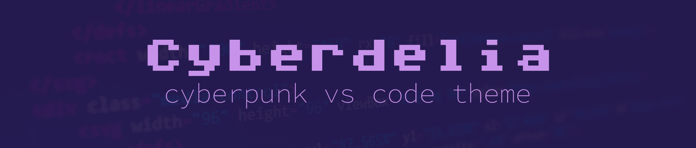
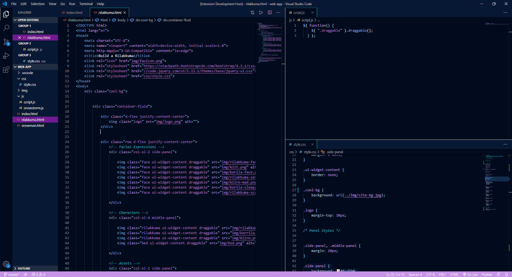

# Cyberdelia
## A dark cyberpunk inspired theme sure to elevate your code.

* Split the editor (`Cmd+\` on macOS or `Ctrl+\` on Windows and Linux)
* Toggle preview (`Shift+CMD+V` on macOS or `Shift+Ctrl+V` on Windows and Linux)
* Press `Ctrl+Space` (Windows, Linux) or `Cmd+Space` (macOS) to see a list of Markdown snippets

### For more information
* [Visual Studio Code's Markdown Support](http://code.visualstudio.com/docs/languages/markdown)
* [Markdown Syntax Reference](https://help.github.com/articles/markdown-basics/)

**Enjoy!**
